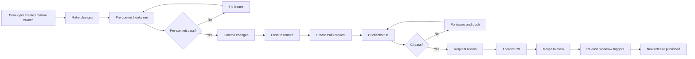

# CI/CD Automation Pipeline

This document describes the complete automation chain for the xcsh project, including all GitHub Actions workflows, their logical flow, and developer guidelines for working with the system.

## Table of Contents

- [Overview](#overview)
- [Workflow Architecture](#workflow-architecture)
- [Detailed Workflow Descriptions](#detailed-workflow-descriptions)
- [Branch Protection Rules](#branch-protection-rules)
- [Developer Workflow](#developer-workflow)
- [Automation Chain Flow](#automation-chain-flow)
- [Trigger Reference](#trigger-reference)
- [Troubleshooting](#troubleshooting)

---

## Overview

The xcsh project uses a **fully automated CI/CD pipeline** with:

- **5 GitHub Actions workflows** handling sync, CI, release, docs, and testing
- **Protected main branch** requiring Pull Requests for all changes
- **Automated upstream spec sync** that creates and merges PRs
- **Multi-platform binary builds** (Linux, macOS Intel/ARM, Windows)
- **Automatic publishing** to GitHub releases, npm, and Homebrew

### Key Principles

1. **Never bypass branch protection** - Always use Pull Requests
2. **Trust the automation toolchain** - Workflows handle releases automatically
3. **Pre-commit hooks catch issues early** - Validate before pushing
4. **Zero-downtime updates** - Auto-merge sync PRs when CI passes

---

## Workflow Architecture

```
┌─────────────────────────────────────────────────────────────────────┐
│                    GitHub Actions Workflows                        │
└─────────────────────────────────────────────────────────────────────┘

┌────────────────────┐    ┌────────────────────┐    ┌────────────────────┐
│ 1. Upstream Sync │ →  │ 2. CI Pipeline   │ →  │ 3. Release       │
│ sync-upstream-     │    │ ci.yml            │    │ release.yml       │
│ specs.yml          │    │                   │    │                   │
│ • Daily check      │    │ • Lint           │    │ • Version tag     │
│ • PR creation     │    │ • Test (3 plat)  │    │ • Build binaries  │
│ • Auto-merge      │    │ • Verify gen.     │    │ • GitHub release  │
└────────────────────┘    └────────────────────┘    └────────────────────┘
        ↓                        ↓                        ↓
   (PR merges)           (CI passes)          (Release published)
                                                        ↓
                                          ┌────────────────────┐
                                          │ 4. Documentation │
                                          │ docs.yml          │
                                          │ • Platform docs   │
                                          │ • Command refs   │
                                          │ • Deploy gh-pages │
                                          └────────────────────┘

┌────────────────────┐    ┌────────────────────┐
│ 5. Regression     │    │ 6. Daily Check    │
│ test-regression    │    │ sync-upstream-     │
│ .yml             │    │ specs.yml          │
│ • Known bugs      │    │ • 6 AM UTC        │
│ • Acceptance      │    │ • Version compare  │
│ • Full suite      │    │ • Auto-update     │
└────────────────────┘    └────────────────────┘
```

---

## Detailed Workflow Descriptions

### 1. sync-upstream-specs.yml - Upstream Synchronization

**Purpose**: Automatically sync with F5 XC API specifications when new versions are released.

**Triggers**:

- `schedule`: Daily at 06:00 UTC
- `repository_dispatch`: From upstream `f5xc-api-enriched` repo (type: `enriched-specs-updated`)
- `workflow_dispatch`: Manual trigger
- `push`: When config files change (`domain_config.yaml`, `generate-domains.ts`, `generate-docs.ts`, `cli-examples.yaml`)

**Jobs & Flow**:

```
check-upstream (ubuntu-latest)
  ├─ Fetches latest release from upstream
  ├─ Compares with .specs/.version
  └─ Outputs: has_updates, new_version, current_version
        ↓
        ├─ update-and-regenerate [if: has_updates == true]
        │   ├─ Downloads new specs from upstream
        │   ├─ Regenerates domains_generated.ts
        │   ├─ Regenerates completions
        │   ├─ Runs tests
        │   ├─ Creates PR with auto-merge enabled
        │   ├─ Sets commit statuses for branch protection
        │   └─ Reviews requested from @robinmordasiewicz
        │
        └─ no-updates [if: has_updates == false]
            └─ Logs: "No updates available"
```

**Key Features**:

- Auto-merge enabled for sync PRs (squash merge, delete branch)
- Sets commit statuses to satisfy branch protection: Lint, Test (3 platforms), Build
- PR title format: `chore: sync upstream specs to {new_version}`

---

### 2. ci.yml - Continuous Integration

**Purpose**: Validate all code changes before they can be merged to main.

**Triggers**:

- `push`: To main or master branches (excludes `.md` and `docs/` files)
- `pull_request`: To main or master branches (excludes `.md` and `docs/` files)
- `workflow_dispatch`: Manual trigger for automated PRs

**Jobs & Flow**:

```
lint (ubuntu-latest)
  ├─ TypeScript type checking (npm run typecheck)
  ├─ ESLint (npx eslint --fix src/)
  ├─ Prettier (npx prettier --write src/)
  └─ Security audit (npm audit --audit-level=high)
        ↓
lint-python (ubuntu-latest)
  ├─ Ruff linting
  └─ Ruff formatting
        ↓
test (matrix: ubuntu-latest, macos-latest, windows-latest)
  ├─ Node 22 on each platform
  ├─ Runs npm run test:unit
  ├─ Uploads coverage to codecov
  └─ Runs for all combinations:
      • ubuntu-latest + node 22
      • macos-latest + node 22
      • windows-latest + node 22
        ↓
verify-generated (ubuntu-latest)
  ├─ Regenerates domains_generated.ts
  ├─ Regenerates completions/*
  └─ Validates against committed files
        ↓
check-e2e-credentials (ubuntu-latest)
  ├─ Checks if F5XC_API_TOKEN secret is set
  └─ Outputs: has-credentials (true/false)
        ↓
        └─ e2e-tests (ubuntu-latest) [if: has-credentials == true]
            ├─ Runs E2E test suite
            ├─ Uses test namespace
            └─ Cleans up resources on failure
        ↓
build (ubuntu-latest) [depends on: lint, lint-python, test, verify-generated]
  ├─ Runs npm run build
  ├─ Creates dist/ directory
  └─ Uploads dist/ and completions/ as artifacts
```

**Required Status Checks** (for branch protection):

1. **Lint** - TypeScript, ESLint, Prettier, security audit
2. **Test (ubuntu-latest, 22)** - Linux unit tests
3. **Test (macos-latest, 22)** - macOS unit tests
4. **Test (windows-latest, 22)** - Windows unit tests
5. **Build** - Full build verification

**Note**: Only the `build` job's status is required for branch protection, but all jobs must complete successfully for a successful run.

---

### 3. release.yml - Release Automation

**Purpose**: Automatically build, sign, publish, and distribute new releases when code is merged to main.

**Triggers**:

- `push`: To main branch only (after CI passes)

**Concurrency**: Cancels in-progress runs (`group: release-${{ github.ref }}`)

**Jobs & Flow**:

```
test (ubuntu-latest)
  ├─ Runs npm run test:unit
  └─ Runs npm run typecheck
        ↓
version (ubuntu-latest) [depends on: test]
  ├─ Reads upstream version from .specs/index.json
  ├─ Generates timestamp: `YYMMDDHHMM` (UTC)
  ├─ Creates version string: `v{upstream_api_version}-{timestamp}`
  │   Example: v2.0.21-2601080650
  ├─ Creates git tag
  └─ Pushes tag to origin
        ↓
        ├─ build-linux (ubuntu-latest)
        │   ├─ Builds for linux/amd64
        │   ├─ Builds for linux/arm64
        │   └─ Uploads artifacts
        │
        ├─ build-macos (macos-latest)
        │   ├─ Builds for darwin/amd64 (Intel)
        │   ├─ Builds for darwin/arm64 (Apple Silicon)
        │   └─ Uploads artifacts
        │
        └─ build-windows (windows-latest)
            ├─ Builds for windows/amd64
            ├─ Builds for windows/arm64
            └─ Uploads artifacts
        ↓
create-release (ubuntu-latest) [depends on: version, build-linux, build-macos, build-windows]
  ├─ Downloads all build artifacts
  ├─ Generates SHA256 checksums for all binaries
  ├─ Creates GitHub release with tag
  ├─ Attaches:
  │   • xcsh-linux-amd64
  │   • xcsh-linux-arm64
  │   • xcsh-darwin-amd64
  │   • xcsh-darwin-arm64
  │   • xcsh-windows-amd64.exe
  │   • xcsh-windows-arm64.exe
  │   • SHA256 checksums.txt
  │   • Shell completions
  └─ Outputs: version
        ↓
        ├─ publish-npm (ubuntu-latest) [depends on: create-release]
        │   ├─ Runs npm publish
        │   └─ Publishes to npm registry
        │
        └─ sign-macos (macos-latest) [depends on: create-release]
            ├─ Signs binaries with Apple Developer ID
            ├─ Submits to Apple notarization service
            ├─ Stapes notarization ticket
            └─ Updates Homebrew cask with SHA256 hashes
```

**Version Format**: `v{upstream_api_version}-{YYMMDDHHMM}`

- Upstream API version from `.specs/index.json` (e.g., 2.0.21)
- UTC timestamp for uniqueness (e.g., 2601080650 = 2026-01-08 06:50)
- Example: `v2.0.21-2601080650`

**Distribution Channels**:

1. GitHub releases (all platforms with checksums)
2. npm package (@robinmordasiewicz/xcsh)
3. Homebrew cask (signed binaries with SHA256 hashes)

---

### 4. docs.yml - Documentation Generation

**Purpose**: Generate platform-specific installation documentation and deploy to GitHub Pages.

**Triggers**:

- `release`: When release is published (from release.yml)
- `workflow_run`: When release.yml completes (via `workflow_run` trigger)
- `workflow_dispatch`: Manual trigger with options:
  - `force_regenerate`: Force regeneration of all docs
  - `test_homebrew`: Test Homebrew installation process
- `push`: When docs/, mkdocs.yml, or scripts/generate-*-docs.py change

**Concurrency**: Cancels in-progress runs (`group: docs-deployment`)

**Jobs & Flow**:

```
wait-for-release (ubuntu-latest) [if: push event]
  └─ Waits for release workflow to complete
        ↓
check-release (ubuntu-latest) [depends on: wait-for-release]
  ├─ Gets latest release from GitHub API
  ├─ Outputs: version
  └─ Verifies release exists
        ↓
        ├─ build-windows-docs (windows-latest) [depends on: check-release]
        │   ├─ Downloads xcsh-windows-amd64.exe from release
        │   ├─ Generates Windows install documentation
        │   └─ Uploads as artifact
        │
        └─ build (macos-latest) [depends on: check-release, build-windows-docs]
            ├─ Downloads xcsh-darwin-amd64 from release
            ├─ Tests Homebrew installation:
            │   └─ Retry logic with exponential backoff (10s, 20s, 40s)
            ├─ Tests install.sh script:
            │   └─ Retry logic with exponential backoff
            ├─ Tests source build:
            │   └─ Cleans, installs deps, builds from scratch
            ├─ Generates command documentation:
            │   └─ Runs xcsh and outputs all commands
            ├─ Generates subscription documentation:
            │   └─ Queries F5XC API for tier requirements
            ├─ Validates all required docs exist:
            │   ├─ docs/install/binary.md
            │   ├─ docs/install/homebrew.md
            │   ├─ docs/install/script.md
            │   ├─ docs/install/source.md
            │   └─ docs/install/environment-variables.md
            ├─ Builds MkDocs site
            └─ Deploys to gh-pages branch (force push)
```

**Key Features**:

- Platform-specific documentation generated from real binaries
- Tests installation methods with actual binaries
- Validates documentation completeness before deployment
- Force-pushes to gh-pages (not PR-based)

---

### 5. test-regression.yml - Regression Testing

**Purpose**: Validate known bugs don't reappear and run acceptance tests.

**Triggers**:

- `push`: To main or develop branches
- `pull_request`: To main branch

**Jobs & Flow**:

```
regression-check (ubuntu-latest)
  └─ Runs tests/integration/known-bugs.test.ts
        ↓
acceptance-tests (ubuntu-latest)
  └─ Runs tests/acceptance/ directory
        ↓
comprehensive-test-suite (ubuntu-latest) [depends on: regression-check, acceptance-tests]
  ├─ Runs full test suite with coverage
  ├─ Uploads coverage to codecov
  └─ Generates test summary
        ↓
test-summary (ubuntu-latest) [depends on: all above, if: always()]
  └─ Generates GitHub Actions step summary
```

---

## Branch Protection Rules

### Main Branch Protection Settings

**Status**: Protected (Strict)

#### Required Status Checks

All of these **must pass** before merging:

| Check | Purpose | Workflow |
|--------|---------|-----------|
| **Lint** | TypeScript, ESLint, Prettier, security | ci.yml |
| **Test (ubuntu-latest, 22)** | Linux unit tests | ci.yml |
| **Test (macos-latest, 22)** | macOS unit tests | ci.yml |
| **Test (windows-latest, 22)** | Windows unit tests | ci.yml |
| **Build** | Build verification | ci.yml |

#### Pull Request Requirements

- **Minimum approvals**: 1 required
- **Stale review dismissal**: Disabled
- **Code owner reviews**: Not enforced
- **Last push approval**: Not required

#### Restrictions

- **Force pushes**: Disabled
- **Deletions**: Disabled
- **Require signed commits**: Disabled
- **Require linear history**: Disabled
- **Enforce for admins**: Disabled (admins are **not** exempt)

---

## Developer Workflow

### Making Changes



### Step-by-Step Process

1. **Create Feature Branch**

   ```bash
   git checkout -b feature/my-change
   ```

2. **Make Changes**

   ```bash
   # Edit files...
   ```

3. **Pre-commit Hooks Run** (automatic on `git commit`)
   - Trim trailing whitespace
   - Validate YAML/JSON syntax
   - Lint shell scripts (shellcheck)
   - Lint Python code (ruff)
   - Lint TypeScript (ESLint)
   - Format TypeScript (Prettier)
   - Validate docs folder structure
   - Check Markdown links
   - **Check for commits to main branch** (prevents direct main commits)

4. **Commit Changes**

   ```bash
   git add .
   git commit -m "feat: add my feature"
   ```

5. **Push to Remote**

   ```bash
   git push -u origin feature/my-change
   ```

6. **Create Pull Request**

   ```bash
   gh pr create --title "feat: add my feature" --base main
   ```

7. **CI Checks Run Automatically**
   - Lint (TypeScript, ESLint, Prettier)
   - Test (Linux, macOS, Windows) - 3 platforms
   - Verify Generated (regeneration check)
   - Build (artifact creation)
   - E2E Tests (if credentials available)

8. **Wait for CI to Pass**
   - All 5 required status checks must pass
   - No intervention needed for automated sync PRs

9. **Request Review**
   - At least 1 approval required
   - Review can be from any team member

10. **Merge to Main**

    ```bash
    gh pr merge <pr-number> --squash
    ```

    - **Never use** `--admin` flag (bypasses branch protection)
    - Wait for all checks to pass

11. **Release Triggers Automatically**
    - CI runs on push to main
    - Release workflow triggers after CI passes
    - New version created and published

12. **Documentation Updates Automatically**
    - Docs workflow triggers after release
    - Platform-specific docs generated
    - Deployed to gh-pages

---

## Automation Chain Flow

### Complete Automation Sequence

```
┌─────────────────────────────────────────────────────────────────────┐
│ TRIGGER: Upstream f5xc-api-enriched releases new specs          │
└─────────────────────────────────────────────────────────────────────┘
                              ↓
                  repository_dispatch event
                  (type: enriched-specs-updated)
                              ↓
        ┌─────────────────────────────────────────┐
        │ sync-upstream-specs.yml               │
        │ Job 1: check-upstream              │
        │ • Check .specs/.version vs upstream   │
        │ • Output: has_updates, new_version   │
        └─────────────────────────────────────────┘
                              ↓
                    has_updates == true?
                    /        \
                   No         Yes
                   /            \
        ┌──────────────┐  ┌─────────────────────────────────┐
        │ No-op       │  │ Job 2: update-and-regenerate  │
        │ (log only)  │  │ • Download new specs            │
        └──────────────┘  │ • Regenerate domains_generated.ts  │
                           │ • Regenerate completions         │
                           │ • Run tests                   │
                           │ • Create PR                    │
                           │   - Auto-merge enabled         │
                           │   - Squash merge              │
                           │   - Delete branch             │
                           │ • Set commit statuses:          │
                           │   - Lint ✓                   │
                           │   - Test (3 platforms) ✓      │
                           │   - Build ✓                  │
                           └─────────────────────────────────┘
                              ↓
                    Branch created
                              ↓
        ┌─────────────────────────────────────────┐
        │ ci.yml (triggered by PR creation)   │
        │ Job 1: lint                       │
        │ • TypeScript type check                │
        │ • ESLint                          │
        │ • Prettier                         │
        │ • Security audit                    │
        └─────────────────────────────────────────┘
                              ↓
        ┌─────────────────────────────────────────┐
        │ ci.yml                            │
        │ Job 2: test (matrix)               │
        │ • ubuntu-latest + node 22            │
        │ • macos-latest + node 22            │
        │ • windows-latest + node 22            │
        └─────────────────────────────────────────┘
                              ↓
        ┌─────────────────────────────────────────┐
        │ ci.yml                            │
        │ Job 3: verify-generated             │
        │ • Regenerate domains_generated.ts     │
        │ • Regenerate completions             │
        │ • Validate against committed files     │
        └─────────────────────────────────────────┘
                              ↓
        ┌─────────────────────────────────────────┐
        │ ci.yml                            │
        │ Job 4: build                      │
        │ • npm run build                    │
        │ • Upload dist/ artifacts            │
        └─────────────────────────────────────────┘
                              ↓
                    All required checks pass ✓
                              ↓
        ┌─────────────────────────────────────────┐
        │ Auto-merge via branch protection    │
        │ (for sync PRs only)                │
        └─────────────────────────────────────────┘
                              ↓
                    PR merged to main ✓
                              ↓
                    git push to main
                              ↓
        ┌─────────────────────────────────────────┐
        │ ci.yml (triggered by push to main) │
        │ • Re-runs all checks              │
        │ • Validates merged code             │
        └─────────────────────────────────────────┘
                              ↓
                    CI checks pass ✓
                              ↓
        ┌─────────────────────────────────────────┐
        │ release.yml (triggered by push)     │
        │ Job 1: test                       │
        │ • npm run test:unit               │
        │ • npm run typecheck               │
        └─────────────────────────────────────────┘
                              ↓
        ┌─────────────────────────────────────────┐
        │ release.yml                        │
        │ Job 2: version                   │
        │ • Read .specs/index.json            │
        │ • Generate UTC timestamp            │
        │ • Create version: v{ver}-{time}    │
        │ • Create git tag                  │
        │ • Push tag to origin              │
        └─────────────────────────────────────────┘
                              ↓
        ┌─────────────────────────────────────────┐
        │ release.yml                        │
        │ Job 3: build (matrix)             │
        │ • linux/amd64                     │
        │ • linux/arm64                     │
        │ • darwin/amd64 (Intel Mac)        │
        │ • darwin/arm64 (Apple Silicon)     │
        │ • windows/amd64                   │
        │ • windows/arm64                   │
        │ • Upload artifacts                 │
        └─────────────────────────────────────────┘
                              ↓
        ┌─────────────────────────────────────────┐
        │ release.yml                        │
        │ Job 4: create-release            │
        │ • Download all artifacts            │
        │ • Generate SHA256 checksums        │
        │ • Create GitHub release with tag   │
        │ • Attach binaries + checksums      │
        └─────────────────────────────────────────┘
                              ↓
                    GitHub release published ✓
                              ↓
        ┌─────────────────────────────────────────┐
        │ release.yml                        │
        │ Job 5: publish-npm              │
        │ • npm publish                     │
        └─────────────────────────────────────────┘
                              ↓
                    npm package published ✓
                              ↓
        ┌─────────────────────────────────────────┐
        │ release.yml                        │
        │ Job 6: sign-macos               │
        │ • Sign with Apple Developer ID     │
        │ • Notarize with Apple            │
        │ • Staple ticket                  │
        │ • Update Homebrew cask           │
        └─────────────────────────────────────────┘
                              ↓
                    macOS binaries signed ✓
                    Homebrew cask updated ✓
                              ↓
        ┌─────────────────────────────────────────┐
        │ docs.yml (workflow_run trigger)      │
        │ Triggered by: release complete     │
        │                                   │
        │ Job 1: wait-for-release          │
        │ • Wait for release.yml to finish   │
        └─────────────────────────────────────────┘
                              ↓
        ┌─────────────────────────────────────────┐
        │ docs.yml                           │
        │ Job 2: check-release             │
        │ • Get release from GitHub API      │
        │ • Output version                  │
        └─────────────────────────────────────────┘
                              ↓
        ┌─────────────────────────────────────────┐
        │ docs.yml                           │
        │ Job 3: build-windows-docs        │
        │ • Download Windows binary           │
        │ • Generate Windows install docs     │
        └─────────────────────────────────────────┘
                              ↓
        ┌─────────────────────────────────────────┐
        │ docs.yml                           │
        │ Job 4: build (macos)            │
        │ • Download macOS binary             │
        │ • Test Homebrew install          │
        │ • Test install.sh                │
        │ • Test source build               │
        │ • Generate command docs           │
        │ • Generate subscription docs       │
        │ • Validate required docs          │
        │ • Build MkDocs site             │
        │ • Deploy to gh-pages            │
        └─────────────────────────────────────────┘
                              ↓
                    Documentation deployed ✓
                    https://robinmordasiewicz.github.io/f5xc-xcsh
```

### Timing Example (Typical Release)

| Stage | Duration | When |
|--------|----------|------|
| Upstream release | N/A | Upstream publishes new API specs |
| Sync detection | ~30s | Daily 6 AM UTC or immediate via repository_dispatch |
| PR creation | ~1 min | Automated by sync workflow |
| CI checks | ~10 min | Runs on PR creation |
| Auto-merge | Immediate | When CI passes (sync PRs only) |
| Release workflow | ~15 min | After merge to main |
| Docs workflow | ~8 min | After release completes |
| **Total** | **~35 min** | From upstream release to docs deployed |

---

## Trigger Reference

### Workflow Trigger Matrix

| Workflow | Triggers | Runs When |
|----------|-----------|------------|
| **sync-upstream-specs.yml** | `schedule`, `repository_dispatch`, `workflow_dispatch`, `push` | Daily 6 AM UTC, upstream event, manual, config changes |
| **ci.yml** | `push`, `pull_request`, `workflow_dispatch` | Push to main/master, PR to main/master, manual |
| **release.yml** | `push` | Push to main only (after CI passes) |
| **docs.yml** | `release`, `workflow_run`, `workflow_dispatch`, `push` | Release published, release workflow completes, manual, docs changes |
| **test-regression.yml** | `push`, `pull_request` | Push to main/develop, PR to main |

### Event Types

#### `schedule`

```yaml
on:
  schedule:
    - cron: '0 6 * * *'  # Daily at 6 AM UTC
```

#### `repository_dispatch`

```yaml
on:
  repository_dispatch:
    types: [enriched-specs-updated]
```

Triggered by upstream repo calling GitHub API to notify this repo.

#### `workflow_run`

```yaml
on:
  workflow_run:
    workflows: [release.yml]
    types: [completed]
```

Triggers when another workflow finishes successfully.

#### `push`

```yaml
on:
  push:
    branches: [main, master]
    paths-ignore: ['**.md', 'docs/**']
```

#### `pull_request`

```yaml
on:
  pull_request:
    branches: [main, master]
    paths-ignore: ['**.md', 'docs/**']
```

---

## Troubleshooting

### Common Issues

#### 1. CI Fails on Tests

**Symptom**: Test job fails on one or more platforms.

**Solutions**:

- Check test logs for specific failures
- Run tests locally: `npm run test:unit`
- Verify Node.js version (should be 22)
- Check platform-specific issues (Windows paths, macOS permissions, Linux dependencies)

#### 2. Verify Generated Fails

**Symptom**: Regenerated code doesn't match committed files.

**Solutions**:

- Run: `npm run generate:all` to regenerate files
- Check if specs changed in `.specs/`
- Commit regenerated files together with source changes
- Never manually edit `domains_generated.ts`

#### 3. Release Workflow Times Out on macOS

**Symptom**: `sign-macos` job times out waiting for notarization.

**Solutions**:

- This is a transient Apple API issue
- Retry the release workflow manually
- No code changes needed
- Apple service eventually responds

#### 4. Pre-commit Hook Blocks Commit to Main

**Symptom**: `Prevent commits to main/master` hook fails.

**Solutions**:

- **Expected behavior** - main branch is protected
- Create feature branch: `git checkout -b feature/my-change`
- Commit on feature branch instead

#### 5. Windows Build Fails with `'.' is not recognized`

**Symptom**: Build script fails on Windows with syntax error.

**Solutions**:

- Ensure scripts specify bash explicitly
- Use `bash script.sh` instead of `./script.sh`
- This is a Windows path resolution issue

#### 6. GitHub Release Not Created

**Symptom**: Release workflow completes but no release appears.

**Solutions**:

- Check `version` job output for generated tag
- Verify tag was pushed: `git tag -l`
- Check release job logs for GitHub API errors
- Verify token has `repo` scope permissions

#### 7. Docs Workflow Doesn't Run

**Symptom**: Release published but docs not updated.

**Solutions**:

- Check `docs.yml` workflow_run trigger configuration
- Verify `release` workflow completed successfully
- Check docs workflow logs for errors
- Manually trigger docs workflow with `force_regenerate: true`

### Manual Interventions

#### If Auto-merge Fails

For sync PRs that don't auto-merge:

1. Check CI status on PR
2. Verify all 5 required checks pass
3. Manually merge with: `gh pr merge <pr-number> --squash`
4. **Never use** `--admin` flag

#### If Release Fails

To retry a release:

1. Create minimal PR (e.g., README update)
2. Let CI run and pass
3. Merge PR to trigger release workflow
4. Release will retry automatically

#### To Force Doc Regeneration

```bash
gh workflow run docs.yml -f force_regenerate=true
```

---

## Summary

### Key Automation Features

✅ **Fully automated** - From upstream sync to release to deployment
✅ **Zero-downtime** - Auto-merge sync PRs when CI passes
✅ **Multi-platform** - Builds for Linux, macOS (Intel/ARM), Windows
✅ **Secure** - macOS binaries signed and notarized
✅ **Multi-channel** - GitHub releases, npm, Homebrew
✅ **Validated** - All changes tested on 3 platforms before release
✅ **Documented** - Platform-specific docs generated from real binaries

### Developer Responsibilities

1. ✅ Create feature branches for all changes
2. ✅ Use Pull Requests for all changes
3. ✅ Wait for CI checks to pass before merging
4. ✅ Never bypass branch protection (`--admin` flag)
5. ✅ Trust the automation toolchain

### What NOT To Do

❌ Push directly to main branch
❌ Use `gh pr merge --admin` to bypass checks
❌ Create empty commits to trigger workflows
❌ Skip pre-commit hooks (`--no-verify`)
❌ Manually edit generated files (`domains_generated.ts`)
❌ Manually create releases (let workflow handle it)
❌ Manually publish to npm (let workflow handle it)
❌ Manually update Homebrew (let workflow handle it)

---

## Additional Resources

- [AGENTS.md](../AGENTS.md) - GitHub operations guidelines
- [README.md](../README.md) - Project overview and installation
- [E2E Testing Guide](../tests/e2e/README.md) - End-to-end testing
- [GitHub Workflows](../.github/workflows/) - Workflow source files
